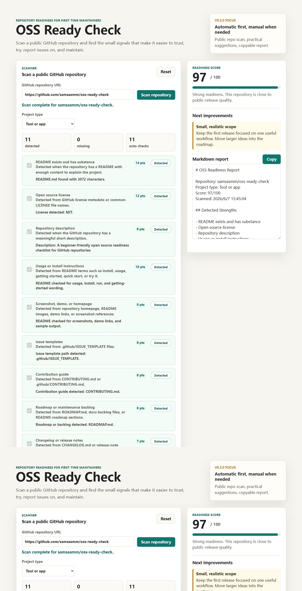

# OSS Ready Check

OSS Ready Check is a small, beginner-friendly tool that helps first-time maintainers scan whether a public GitHub repository is ready to be shared as a real open source project.

It focuses on the parts new maintainers often miss: README quality, license, repository description, install instructions, screenshots or demo links, issue templates, contribution guide, release notes, roadmap, workflows, and recent maintenance signals.



## Why This Exists

Many beginner repositories contain working code, but they are difficult for other people to understand, try, report issues on, or contribute to. OSS Ready Check turns those expectations into a practical checklist with clear next steps.

The goal is not to judge projects harshly. The goal is to help maintainers make small, visible improvements that make their projects easier to trust and maintain.

## Who It Helps

- First-time GitHub users preparing their first public repository
- Students and self-taught developers learning open source workflow
- Small project maintainers who want a release checklist
- AI-assisted developers who want a more transparent, maintainable repository

## Core Workflow

The first version is a static web app that runs in the browser. No account, backend, or installation is required.

It will let users:

- Scan a public GitHub repository URL
- See an automatic readiness score
- Receive practical improvement suggestions
- Copy a Markdown report into their README, issue, or project notes

## Current v0.2.0 Features

- Public GitHub repository URL scanner
- Automatic checks through GitHub's public API
- Detection evidence for each readiness signal
- Manual fallback for checks that automation cannot judge reliably
- Copyable Markdown report with detected strengths and recommended improvements

## Try It Locally

Live demo:

```text
https://samsasmm.github.io/oss-ready-check/
```

Open `index.html` in a browser.

For a local preview server:

```bash
python -m http.server 4173
```

Then open:

```text
http://127.0.0.1:4173
```

Success looks like this:

- The page shows the OSS Ready Check interface
- Entering a public GitHub repository URL scans the repository
- The score updates after detected checks are completed
- The Markdown report updates with the repository name, score, and recommendations

## Project Status

Status: early development

Current focus: improve the automatic scanner, refine scoring evidence, and make reports more useful for beginner maintainers.

## Open Source Maintenance Value

OSS Ready Check is designed around practical repository maintenance signals:

- Can a visitor understand the project quickly?
- Can a user try it without guessing?
- Can someone report a useful issue?
- Can a maintainer prepare a clean release?
- Can contributors understand what is welcome?

These are small details, but they are the difference between a code dump and a maintainable open source project.

## AI-Assisted Development Note

This project is being built with Codex-assisted development. The maintainer uses AI to plan, implement, review, document, and verify changes while keeping the project scope, decisions, and release quality human-directed.

## Roadmap

See [ROADMAP.md](ROADMAP.md).

## Contributing

Contributions are welcome after the first public release. See [CONTRIBUTING.md](CONTRIBUTING.md) for the project direction and contribution style.

## License

MIT License. See [LICENSE](LICENSE).
